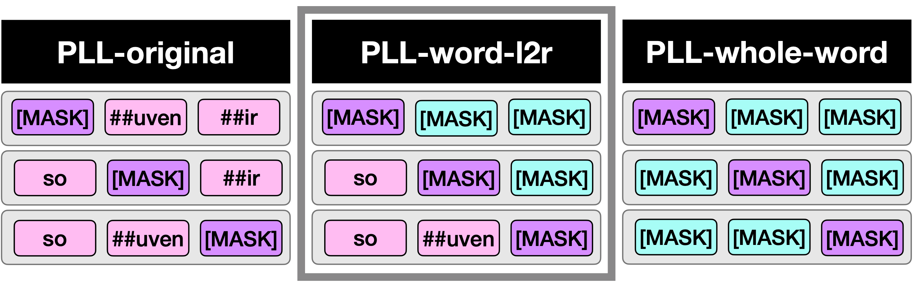
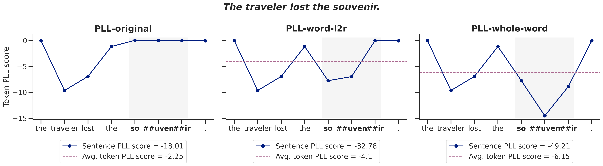

# A Better Way to Do Masked Language Model Scoring
Code accompanying the ACL paper [A Better Way to Do Masked Language Model Scoring](https://arxiv.org/pdf/2305.10588.pdf) by Carina Kauf & Anna Ivanova.

Code adapts the [minicons](https://github.com/kanishkamisra/minicons/tree/master) implementation of [Salazar et al. (2020)](https://www.aclweb.org/anthology/2020.acl-main.240.pdf)'s PLL metric.

## Paper abstract
Estimating the log-likelihood of a given sentence under an autoregressive language model is straightforward: one can simply apply the chain rule and sum the log-likelihood values for each successive token. However, for masked language models, there is no direct way to estimate the log-likelihood of a sentence. To ad- dress this issue, [Salazar et al. (2020)](https://www.aclweb.org/anthology/2020.acl-main.240.pdf) propose to estimate sentence pseudo-log-likelihood (PLL) scores, computed by successively masking each sentence token, retrieving its score using the rest of the sentence as context, and summing the resulting values. Here, we demonstrate that the original PLL method yields inflated scores for out-of-vocabulary words and propose an adapted metric, in which we mask not only the target token, but also all within-word tokens to the right of the target. We show that our adapted metric (*PLL-word-l2r*) outperforms both the original PLL metric and a PLL metric in which all within-word tokens are masked. In particular, it better satisfies theoretical desiderata and better correlates with scores from autoregressive models. Finally, we show that the choice of metric affects even tightly controlled, minimal pair evaluation benchmarks (such as BLiMP), underscoring the importance of selecting an appropriate scoring metric for evaluating MLM properties



We improve on the widely used pseudo-log-likelihood sentence score estimation method for masked language models from [Salazar et al. (2020)](https://www.aclweb.org/anthology/2020.acl-main.240.pdf) by solving the score inflation problem for multi-token words the original PLL metric introduces, without overly penalizing multi-token words. The new metric also fulfills several theoretical desiderata of sentence/word scoring methods better than alternative PLL metrics and is more cognitively plausible:


## Citation
If you use this work, please cite:

```tex
@misc{kauf2023better,
      title={A Better Way to Do Masked Language Model Scoring}, 
      author={Carina Kauf and Anna Ivanova},
      year={2023},
      eprint={2305.10588},
      archivePrefix={arXiv},
      primaryClass={cs.CL}
}
```

***
## Repo structure

#### Master branch
* `adapted_minicons` : A stripped version of the [minicons](https://github.com/kanishkamisra/minicons/tree/master) package in which we adapt the `MaskedLMScorer` class in the `scorer` module
* `better-mlm-scoring-analyses` : Data and scripts used to analyze the novel masked language model scoring metrics

#### Branches
* `master` : Code accompanying the paper A Better Way to Do Masked Language Model Scoring by Carina Kauf & Anna Ivanova
* `pr-branch-into-minicons` : Code used to add the optimized masked-language modeling metric (*PLL-word-l2r*) to the [minicons](https://github.com/kanishkamisra/minicons/tree/master) library maintained by [Kanishka Misra](https://github.com/kanishkamisra).
This repo is a wrapper around the `transformers` [library](https://huggingface.co/transformers) from HuggingFace :hugs: and supports  functionalities for **(i)** extracting word representations from contextualized word embeddings and **(ii)** scoring sequences using language model scoring techniques.
